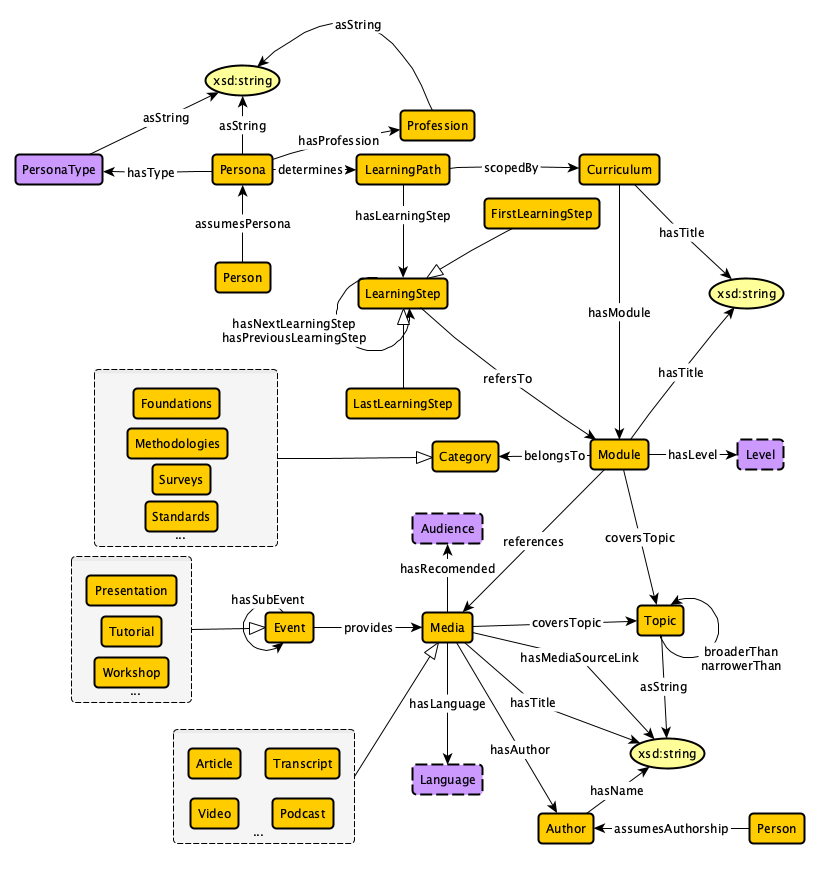
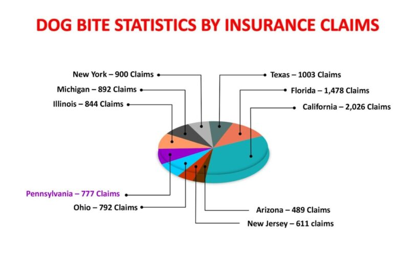
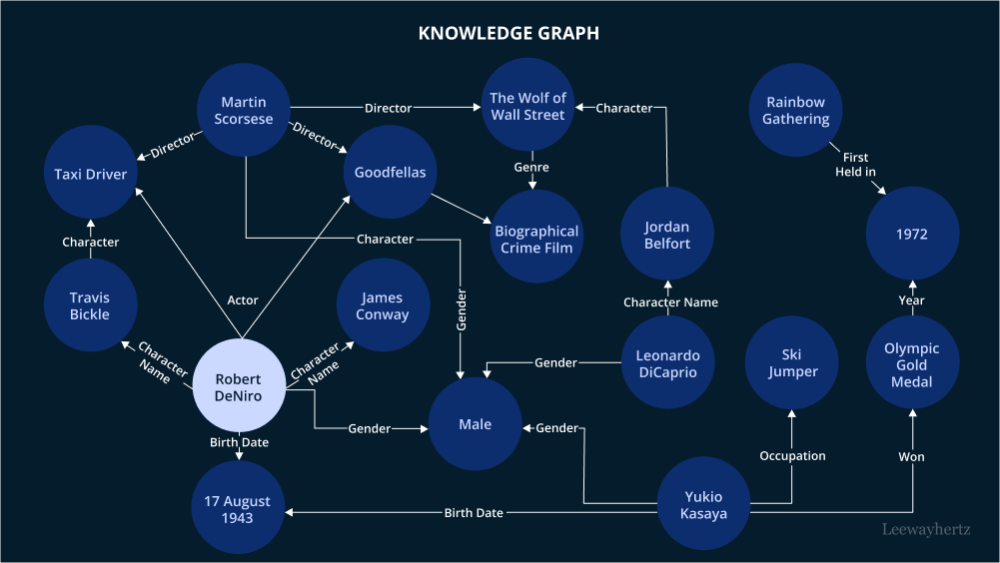
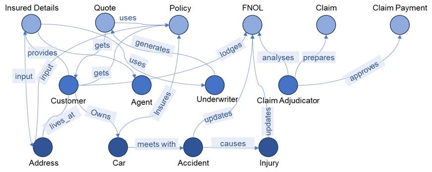

# Evolving AI Learning Management System

### Team: Cognita AI Networks  
- Chris Davis Jaldi  
- Anmol Saini

## Example Inputs and Outputs

### Onboarding
**Age:** 23  
**Select your qualification:** Bachelor’s  
**Please enter your learning goals:** Knowledge graphs and how to structure them semantically.  
**Describe any challenges:** I struggle with understanding axioms.  
**Tell us about yourself:** I’m a graduate student studying computer science. My focus is on knowledge engineering and artificial intelligence.  

### Inference

#### Example 1

**Input:** What axioms should be defined for the LearningStep?  
**Image:**  
  
**Output:** [Example 1 Output](sample-examples/example1.md)

#### Example 2

**Input:** How should I arrange the data in this image as a knowledge graph?  
**Image:**  
  
**Output:** [Example 2 Output](sample-examples/example2.md)

#### Example 3

**Input:** Identify interesting characteristics of this knowledge graph.  
**Image:**  
  
**Output:** [Example 3 Output](sample-examples/example3.md)

#### Example 4

**Input:** What is FNOL in this image and what can you tell me about it?  
**Image:**  
  
**Output:** [Example 4 Output](sample-examples/example4.md)
